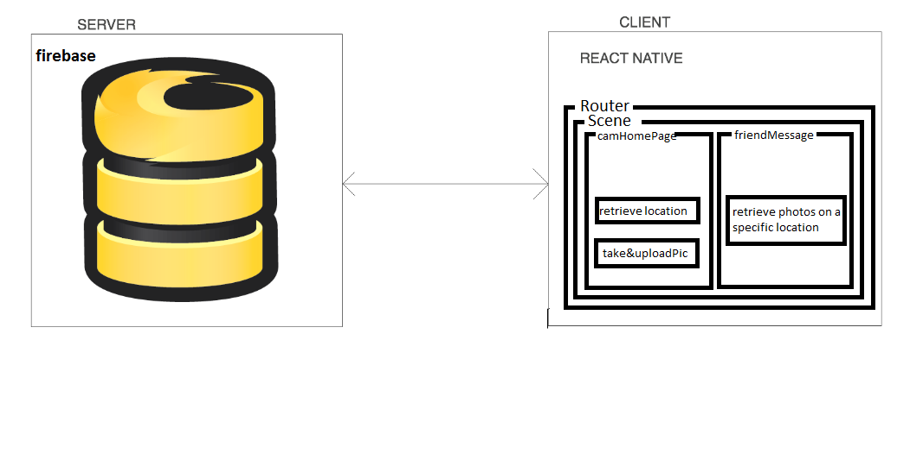

# locMemo 

> locMemo is a react native application that allowes you to store your memories on certin locations , and ONLY view memories when you pass by that location !


## Team

  - __Product Owner__: Sajedah Yousef
  - __Scrum Master__: Hasan Arafah
  - __Development Team Members__:  Saeed Homsi, Noor Atyat.

## Table of Contents

1. [Usage](#Usage)
1. [Architecture](#architecture)
    1. [Tech Stack](#tech-stack)
    1. [System Architecture](#system-architecture)
1. [Requirements](#requirements)
1. [Development](#development)
    1. [Installing Dependencies](#installing-dependencies)
    1. [Tasks](#tasks)
1. [Team](#team)
1. [Contributing](#contributing)

## Usage


> check the landing page to see the video in high reoluation:
[Click Here](http://locmemoo.herokuapp.com)

> download the app on your phone from the link on the landing page
[Click Here](http://locmemoo.herokuapp.com)


## styling guide
```sh
gulp
```

## Architecture

### Tech Stack

1) Front-End
- react-native  

2) Back-End
- firebase

3) Deployment
- Heroku


## Architecture Diagram:


## Requirements


## Development

### Installing Dependencies

From within the root directory:

```sh
git clone https://github.com/Sportitsu/Zarad.git
```

```sh
npm install -g react-native-cli
npm install
react-native link
```

### Simulator:
```sh
Phone platform -- > npm start
react-native run-android
```
### Build:
```
open client/android/ using Android Studio

```


#The Database 
Our Database and Storage is built firebase, which holds url, longitude and latitude for each photo


## Contributing

See [CONTRIBUTING.md](CONTRIBUTING.md) for contribution guidelines.

## Production

See our website [here](http://locmemoo.herokuapp.com/#/).


